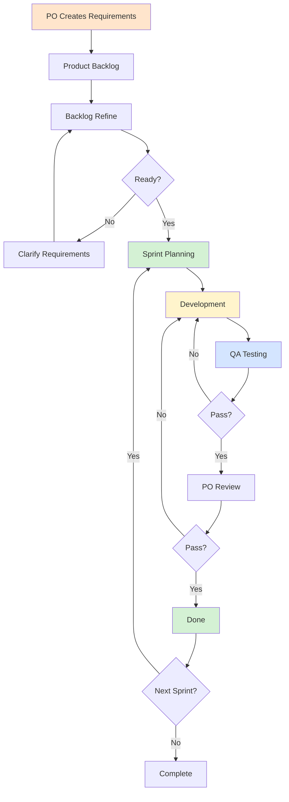

# Scrum Process

## Process Flow

## Scrum Roles

**Product Owner**: Define vision, manage backlog, accept work
**Developers**: Implement features, self-organize, ensure quality
**QA**: Test features, identify bugs, ensure requirements met

## Scrum Process

### 1. Product Backlog
Product Owner creates user stories with:
- Description and acceptance criteria
- Priority and labels
- Estimated Story Points
*See [Refinement Process](2-2%20Refinement%20Process.md) for estimation details*

### 2. Sprint Planning
**Duration**: 2-4 hours
**Participants**: PO, Developers, QA

**Activities**:
1. PO explains Sprint goal
2. Select items from "Ready" backlog
3. Confirm team capacity
4. Create Sprint Backlog

### 3. Development
**Status Flow**: TO DO → In Progress → Ready for Test

**Key Actions**:
- Write code following standards
- Update descriptions and screenshots
- Commit regularly with clear messages

### 4. QA Testing
**Activities**: Execute tests, verify requirements, check edge cases

**Tools**: TestRail, Zephyr, Qase, Jira, Linear
**E2E**: Playwright, Cypress, Selenium
**Visual**: Percy, Chromatic, Applitools

**Pass**: Move to PO Review
**Fail**: Return to Development with feedback

### 5. PO Review
**Criteria**: Meets requirements, good UX, correct business logic

**Pass**: Mark as Done
**Fail**: Return to Development

### 6. Done
**Definition of Done**:
- Code merged to main
- All tests passed
- PO accepted
- Documentation updated
- Deployed

## Scrum Ceremonies

### Daily Standup (15 min)
- What was completed yesterday
- What is planned today
- Any blockers

### Sprint Review
Demonstrate features, collect feedback, update backlog

### Sprint Retrospective
What went well, what needs improvement, action items

## Best Practices

- **Clear Requirements**: Ensure clarity during refinement
- **Small Increments**: Split large tasks
- **Continuous Communication**: Address issues promptly
- **Fast Feedback**: Test and review early
- **Continuous Improvement**: Iterate in retrospectives

## Common Issues

**Requirement Changes**: PO evaluates impact, major changes → next Sprint
**Cannot Complete**: Raise early in standup, adjust scope if needed
**Urgent Bugs**: Prioritize immediately, non-urgent → backlog
