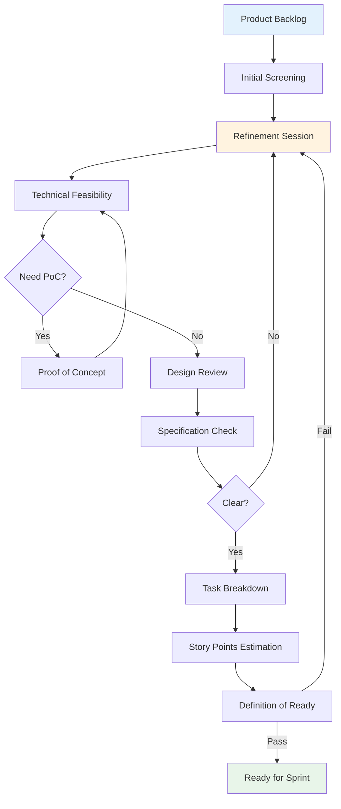

# Refinement Process

## Overview

The Refinement Process ensures user stories are thoroughly reviewed and prepared before Sprint Planning.

## Process Flow



## Refinement Session

**Duration**: 4-6 hours per Sprint
**Participants**: PO, Tech Lead, Developers

**Agenda**:
1. Requirement explanation
2. Technical feasibility assessment
3. Design assets review
4. Specification clarification
5. Task breakdown
6. Story Points estimation

## Technical Feasibility

**Evaluation**:
- Team capability
- Technical risk
- Performance impact
- Dependencies
- Browser compatibility

**Proof of Concept (PoC)**:
Use when:
- New/unfamiliar technology
- High technical uncertainty
- Performance validation needed
- Complex third-party integrations

**PoC Process**: Define questions → Time-box (1-3 days) → Build prototype → Evaluate → Decide

## Design Assets Review

**Checklist**:
- Design mockups completed
- Design system components referenced
- Interactive prototypes (if needed)
- Specifications documented (spacing, colors, typography)
- Edge cases and responsive designs covered

## Specification Completeness

**Check**:
- Functional spec (input, output, logic)
- Interface spec (API endpoints, formats)
- Design spec (visual, interaction, states)
- Performance spec (response time, loading)
- Security spec (validation, encryption)

**Red Flags**:
- Vague terms ("optimize", "improve")
- No specific metrics
- Missing success criteria

## Task Description

### User Story Format
```
As a [role]
I want [feature]
So that [value]

Acceptance Criteria:
- [ ] Criterion 1
- [ ] Criterion 2
```

### BDD Format
For complex logic:
- **Given**: Initial state
- **When**: User action
- **Then**: Expected result

## Task Breakdown

**Vertical Slicing** (Recommended):
Complete feature slice (UI → logic → testing)

**Benefits**:
- Independent completion
- Reduced dependencies
- Early integration
- Continuous value delivery

**Principles**:
- Each task < 7 Story Points (ideal 3-5)
- Each task < 3 days
- Independently verifiable
- Logical sequence

## Story Points Estimation

### What Story Points Reflect
- **Complexity**: Technical difficulty
- **Effort**: Time and energy needed
- **Uncertainty**: Technical risk

**Not precise time** - used for relative comparison

### Point Scale (1, 3, 5, 7, 9)

- **1**: Extremely simple (text, style tweak)
- **3**: Simple (single component, basic form)
- **5**: Medium (multi-step process)
- **7**: Complex (complex logic, multiple integrations)
- **9**: Very complex (recommend splitting)

### Estimation Process
1. PO explains requirements
2. Team discusses approach
3. Independent assessment
4. Reveal simultaneously
5. Discuss differences
6. Reach consensus

### Team Velocity
**Definition**: Total Story Points completed per Sprint

**Usage**:
- Capacity planning for next Sprint
- Track delivery capability
- Identify bottlenecks

**Note**: New teams need 2-3 Sprints to stabilize

## Definition of Ready

Tasks must have:
- [ ] Clear business value
- [ ] Acceptance criteria defined
- [ ] Technical feasibility confirmed
- [ ] Dependencies identified
- [ ] Story Points estimated
- [ ] Design mockups (if needed)
- [ ] API specs (if needed)
- [ ] Team understands requirements

## Non-Functional Requirements

**Checklist**:
- Performance: Page load < 3s, interaction < 100ms
- Security: Input validation, XSS/CSRF protection
- Accessibility: WCAG 2.1 AA compliance
- Visual: Regression testing setup
- E2E: Critical flows identified
- Browser: Chrome, Firefox, Safari, Edge
- i18n: Multi-language support (if needed)
