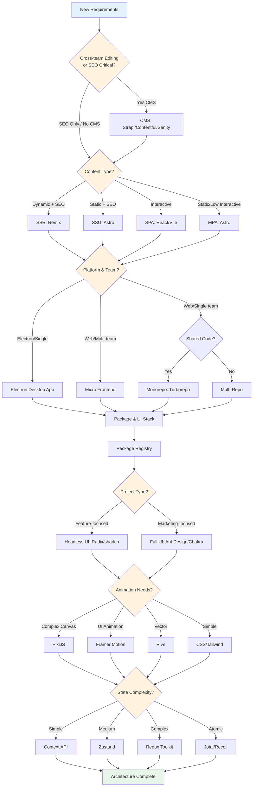
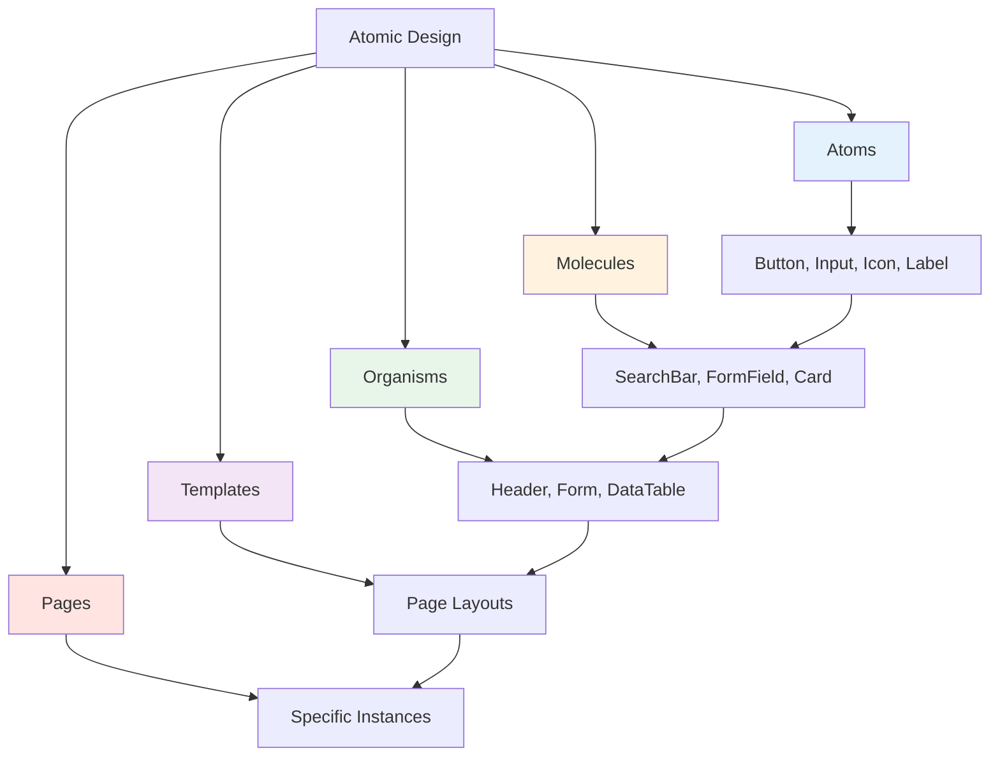

## Overview

This document outlines the technical decision-making process for frontend projects, covering architecture choices, technology selection, and design patterns.

## Frontend Project Decision Flow

## Architecture Decisions

### Content Management System (CMS)

**When to Use CMS**:
- **Cross-team editing requirements**: Marketing, content teams need direct access
- **SEO-critical content**: Blogs, landing pages, product pages
- Frequent content updates by non-technical users
- Multi-language content management

**CMS Options**:
- **Strapi**: Open-source, self-hosted, customizable
- **Contentful**: Cloud-based, powerful API, enterprise-ready
- **Sanity**: Real-time collaboration, flexible content modeling

### Repository Strategy: Monorepo vs Multi-Repo

| Consideration | Monorepo | Multi-Repo |
|---------------|----------|------------|
| **Use Case** | Multiple projects sharing components, unified CI/CD | Independent projects, different tech stacks |
| **Advantages** | Code sharing, atomic changes, unified tooling | Permission isolation, independent deployment, lower learning curve |
| **Disadvantages** | Long build times, complex permission management | Duplicate dependencies, version inconsistencies |
| **Tools** | Turborepo, pnpm workspace | Git Submodules, independent repos |

**When to Use Monorepo**:
- Shared component library across projects
- Unified design system
- Consistent tooling and standards
- Atomic cross-project changes

**When to Use Multi-Repo**:
- Completely independent projects
- Different technology stacks
- Different deployment schedules
- Strict permission boundaries

### Rendering Strategy

**SPA (Single Page Application)**
- Rich interactivity, client-side routing
- Tools: React + React Router, Vite

**MPA (Multi-Page Application)**
- Traditional navigation, SEO-friendly
- Tools: Astro, Multi-page frameworks

**SSG (Static Site Generation)**
- Pre-built HTML, CDN-optimized
- Tools: Astro, Docusaurus

**SSR (Server-Side Rendering)**
- Dynamic content, real-time data
- Tools: Remix

### Platform Options

**Electron**
- Desktop applications requiring hardware control
- File system access, native APIs, system integration
- Cross-platform deployment (Windows, macOS, Linux)

**When to Use Electron**:
- Hardware control needs (USB, Bluetooth, Serial ports)
- Offline-first desktop applications
- System tray applications
- Screen capture or recording tools

### Package Management

**Private Registries**:
- npm private packages, GitHub Packages, GitLab Package Registry
- JFrog Artifactory, Verdaccio
- Version control alongside source code

**Public Registries**:
- npm, yarn, pnpm
- Semantic versioning
- Open-source distribution

### Micro Frontend

**When to Use**:
- Large-scale applications with multiple teams
- Independent deployment cycles
- Technology flexibility across teams

**Approaches**:
- Single-SPA framework
- Web Components
- Iframe integration

## Technology Selection

### Component Strategy

**Project Type Determines UI Approach**:

**Feature-focused Projects** (Internal tools, dashboards, SaaS):
- **Headless UI Libraries**: Radix UI, shadcn/ui
- Maximum flexibility and customization
- Build design system from primitives
- Better performance control

**Marketing-focused Projects** (Landing pages, corporate sites):
- **Full UI Libraries**: Ant Design, Chakra UI
- Rapid prototyping and deployment
- Consistent, polished design out of box
- Rich component ecosystem

### Animation Libraries

**PixiJS**:
- WebGL-powered 2D rendering
- Complex canvas animations, games
- High-performance graphics

**Framer Motion**:
- Declarative React animations
- Gesture support, layout animations
- UI transitions and micro-interactions

**Rive**:
- Vector animations from design tools
- Interactive graphics
- Cross-platform support

**CSS/Tailwind**:
- Simple transitions and transforms
- Lightweight, performant
- Native browser support

### State Management

**Context API**:
- Simple state sharing, built-in solution
- Theme, auth, locale management

**Zustand**:
- Minimal boilerplate, TypeScript support
- Medium complexity state

**Redux Toolkit**:
- Complex state logic, time-travel debugging
- Predictable state updates

**Jotai / Recoil**:
- Atomic state, fine-grained updates
- Component-level optimization

### Data Layer

**Server State**
- React Query, SWR
- Caching, revalidation, optimistic updates

**Form State**
- React Hook Form, Formik
- Validation, performance optimization

**Router State**
- React Router, Next.js Router
- URL state management

**Local/UI State**
- useState, useReducer
- Component-level, transient UI state

## Programming Paradigms

**Functional Programming (FP)**
- Pure functions, immutability, composition
- React: Functional components, Hooks

**Object-Oriented Programming (OOP)**
- Encapsulation, inheritance, polymorphism
- Use cases: API clients, business logic services

## Design Patterns

**Observer Pattern**
- Event emitters, pub/sub systems
- Redux middleware

**Factory Pattern**
- Component factories, API client creation
- Configuration builders

**Singleton Pattern**
- Global instances (store, logger, API client)

**Strategy Pattern**
- Payment gateways, validation strategies
- Authentication methods

**Adapter Pattern**
- API response normalization
- Third-party integration

## Component Architecture

### Atomic Design Methodology

**Atoms**: Button, Input, Label, Icon
**Molecules**: Search Bar, Form Field, Card
**Organisms**: Navigation Bar, Data Table, Form
**Templates**: Page Layouts (Dashboard, Auth)
**Pages**: Specific Instances (Login, Dashboard)

## Testing Strategy Integration

### E2E Testing Frameworks
- **Playwright**: Modern, fast, cross-browser support, visual testing built-in
- **Cypress**: Developer-friendly, great DX, component testing support
- **Choice Criteria**: Playwright for cross-browser + visual testing, Cypress for rapid development

### Visual Testing Tools
- **Percy**: Automated visual reviews, Storybook integration
- **Chromatic**: Visual testing for Storybook components
- **Playwright Screenshots**: Built-in visual comparison
- **Choice Criteria**: Percy for comprehensive visual testing, Chromatic for component-focused workflow

### AI-Powered Development

**MCP (Model Context Protocol) Integration**
- Connect AI assistants to development tools seamlessly
- **Version Control**: Direct repository access, PR management, code search
- **Error Tracking**: Error analysis, performance insights, AI-assisted debugging
- **Design Tools**: Design token extraction, component generation
- **Project Management**: Task management, automated status updates

**Benefits**:
- Context-aware code suggestions
- Automated documentation generation
- Intelligent error analysis and resolution
- Seamless workflow between tools

## Best Practices

- Start simple, add complexity as needed
- Document major decisions (ADR - Architecture Decision Records)
- Consider future scale and team growth
- Evaluate trade-offs systematically
- Ensure team alignment on technology choices
- Implement visual regression testing from day one
- Set up E2E tests for critical user flows
- Leverage MCP for AI-assisted development workflows
- Iterative improvement based on feedback
