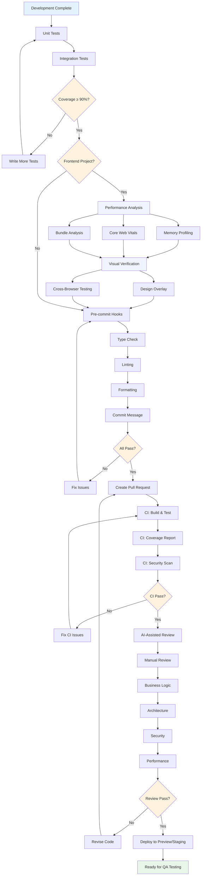

## Overview

This document outlines the testing and quality assurance process for software development, covering local testing, automated checks, manual review, and CI/CD integration. These practices apply to both frontend and backend development.

## Testing & QA Flow



## Local Testing

### Unit Testing

**Frontend Frameworks**:
- Vitest, Jest
- Testing Library, React Testing Library

**Backend Frameworks**:
- pytest (Python)
- Jest (Node.js)
- JUnit (Java)

**Coverage Target**:
- ≥ 90% code coverage
- Focus on critical business logic and edge cases

### Integration Testing

**Purpose**: Test interactions between components/modules

**Frontend**:
- Component integration tests
- API integration tests (MSW, Nock)
- E2E testing (Playwright, Cypress)

**Backend**:
- API endpoint testing
- Database integration tests
- Service-to-service communication

### Performance Analysis

**Frontend Performance**:
- Memory profiling (Chrome DevTools, React DevTools)
- Core Web Vitals (LCP < 2.5s, FID < 100ms, CLS < 0.1)
- Bundle analysis (Rollup Visualizer, webpack-bundle-analyzer)
- Frame rate monitoring
- Lighthouse CI for automated performance testing

**Backend Performance**:
- Response time measurement
- Database query optimization
- Load testing (Locust, k6, Artillery)
- Memory and CPU profiling

### E2E Testing

**Playwright (Recommended)**:
- Cross-browser testing (Chromium, Firefox, WebKit)
- Built-in visual comparison
- Component testing support
- Parallel execution
- Tracing and debugging tools
- Mobile emulation

**Cypress**:
- Developer-friendly API
- Real-time reloading
- Time-travel debugging
- Component testing

**Best Practices**:
- Test critical user journeys
- Use data-testid attributes
- Avoid flaky selectors
- Run in CI/CD pipeline
- Parallelize tests for speed

### Visual Testing

**Percy**:
- Automated visual reviews
- Storybook integration
- Responsive testing across viewports
- Historical comparisons
- Review workflow with approvals

**Chromatic**:
- Visual testing for Storybook
- UI component library testing
- Catches unintended changes
- Collaboration and review tools

**Playwright Visual Comparisons**:
- Built-in screenshot testing
- Pixel-perfect comparisons
- Update snapshots workflow
- Cross-browser visual testing

**Implementation Strategy**:
- Baseline screenshots for components
- Visual regression in CI pipeline
- Review and approve visual changes
- Integration with PR workflow

## Pre-commit Checks

### Husky

Git hooks to run checks before commit

### lint-staged

Only check modified files (faster execution)

### Automated Checks

**Type Checking**:
- Frontend: TypeScript (strict mode, no implicit any)
- Backend: mypy (Python), TypeScript (Node.js)

**Linting**:
- Frontend: ESLint
- Backend: Ruff (Python), ESLint (Node.js)

**Formatting**:
- Frontend: Prettier
- Backend: Black (Python), Prettier (Node.js)

**Commit Message**:
- commitlint
- Format: type(scope): description
- Types: feat, fix, docs, style, refactor, test, chore

## CI Pipeline

### Automated Checks on Push

**Build & Test**
- Run unit tests
- Generate coverage report
- Build verification

**Security Scan**:
- Dependency auditing: npm audit, pnpm audit, yarn audit
- Security platforms: Snyk, Dependabot, WhiteSource
- CVE vulnerability detection
- SAST (Static Application Security Testing): SonarQube, CodeQL

**Visual & E2E Tests**:
- E2E frameworks: Playwright, Cypress, Selenium
- Visual regression: Percy, Chromatic, Applitools
- Cross-browser testing matrix

## Manual Review

### Code Reviewer

**Business Logic**:
- Meets user story requirements
- Edge case handling (null, error, loading states)
- Data validation and error handling

**Security Requirements**:
- Frontend: XSS/CSRF protection, secure data storage
- Backend: Authentication/authorization, input validation, SQL injection prevention
- Sensitive data handling (encryption, secure transmission)

**Architecture Design**:
- Single responsibility principle
- Clear separation of concerns
- Maintainable and scalable code structure

**Performance Considerations**:
- Frontend: Avoid unnecessary re-renders, optimize bundle size
- Backend: Query optimization, caching strategy, resource management

**Framework Best Practices**:
- Frontend: React Hooks patterns, component composition
- Backend: Clean architecture, dependency injection, error handling patterns

### AI-Assisted Review

**Tools**
- AI code reviewers: Copilot, CodeRabbit, Sourcery, Codium
- MCP-integrated code analysis

**Capabilities**:
- Logic optimization suggestions
- Performance improvements
- Security vulnerability detection
- Code style and best practices
- Automated documentation generation

**MCP Integration Benefits**:
- Error tracking context: Review code with production error insights
- Design tool context: Verify implementation matches design specs
- Project management context: Check task completion criteria

## Deployment

### CD Pipeline

**Preview Environment**
- Auto-deploy for each Pull Request
- Team can review actual implementation

**Staging Environment**
- Auto-deploy after merge to develop branch
- Final testing before production

**Production Environment**
- Manual trigger after merge to main branch
- Smoke testing, rollback plan ready

## Monitoring

**Error Tracking**
- Error monitoring: Sentry, Rollbar, Bugsnag, Raygun
- MCP integration for AI-assisted error analysis

**Performance Metrics**
- Core Web Vitals tracking
- APM tools: Datadog, New Relic, Grafana, AppDynamics
- Custom events for business metrics
- Performance CI: Lighthouse CI, WebPageTest

**Visual Monitoring**
- Visual regression platforms: Percy, Chromatic, Applitools
- Build and deployment monitoring

**Alerting**
- Communication: Slack, Discord, Microsoft Teams
- Incident management: PagerDuty, Opsgenie, VictorOps
- On-call rotation and escalation

## Best Practices

- Write tests alongside code (Test-Driven Development)
- Fix issues early (shift left testing)
- Implement visual regression testing from day one
- Cover critical paths with E2E tests
- Automate everything possible
- Use MCP for intelligent code reviews and debugging
- Review thoroughly but efficiently
- Monitor proactively in production
- Maintain high test coverage (≥ 80%)
- Balance speed and quality
- Parallelize tests for faster feedback

## Testing Pyramid

```
       /\
      /  \     E2E Tests (Few)
     /____\    - Critical user flows
    /      \   - Cross-browser
   /________\  Integration Tests (Some)
  /          \ - API integration
 /____________\- Component integration
/              \ Unit Tests (Many)
                 - Pure functions
                 - Business logic
```

**Visual Testing Layer**: Runs across all levels
**MCP Integration**: Enhances all testing phases with AI insights
