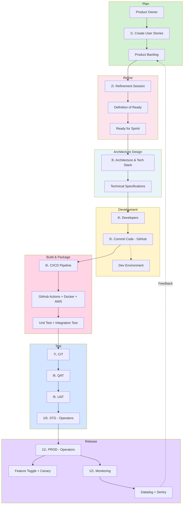

# 1-1 Software Development Lifecycle

## Overview

The Software Development Lifecycle(SDLC) is a comprehensive process from requirements analysis to product maintenance, ensuring orderly and high-quality product delivery.

## Process Diagram

## Phase Details

### Phase 1: Plan

**Overview**: Collect and analyze user requirements, define product features and acceptance criteria

**Activities**:
- Gather user requirements
- Define product features and acceptance criteria
- Assess technical feasibility and costs
- Create user stories and wireframes
- Add to Product Backlog

**Role**: Product Owner
**Tools**: Jira, Figma, FigJam
**Output**: User Stories, Product Backlog

### Phase 2: Refine

**Overview**: Review and validate backlog items to ensure they are ready for development

**Activities**:
- Conduct Refinement Session (1-2 hours weekly)
- Evaluate Technical Feasibility
- Clarify Description and Acceptance Criteria
- Confirm Specification Completeness
- Task Breakdown (Vertical Slicing recommended)
- Story Points Estimation (Fibonacci: 1, 2, 3, 5, 8, 13)
- Definition of Ready Check

**Participants**: Product Owner, Tech Lead, Developer Representatives

**Definition of Ready**:
- Clear business value description
- Acceptance criteria defined
- Technical feasibility confirmed
- Dependencies identified
- Story Points estimated
- Design mockups completed (if needed)
- API specifications defined (if needed)

**Tools**: Jira, Planning Poker
**Output**: Ready for Sprint User Stories

### Phase 3: Architecture Design

**Overview**: Plan technical architecture and data flow, select appropriate technologies

**Activities**:
- Design technical architecture and data flow
- Select technology stack and design patterns
- Define non-functional requirements (performance, security, accessibility)
- Create technical specifications and architecture diagrams

**Tools**: Figma Dev Mode, Excalidraw, Notion
**Output**: Technical Specification, Architecture Diagrams

### Phase 4: Development (Implementation)

**Overview**: Set up development environment, write code, follow coding standards

**Activities**:
- Set up local development environment
- Write code to implement features
- Follow coding standards and design principles
- Commit code regularly
- Test in Dev environment (Engineering Playground)

**Role**: Developers (Frontend & Backend)
**Tools**: GitHub, VSCode, IDE, Dev Environment
**Quality Checks**:
- Code reviews
- Unit tests
- Linting and formatting
- Type checking

### Phase 5: Build & Package

**Overview**: Automated build, testing, and containerization via CI/CD pipeline

**Activities**:
- Trigger automated build process
- Run automated tests (unit & integration)
- Check code coverage
- Build container images (Docker)
- Generate deployment artifacts
- Package for cloud deployment (AWS)

**Tools**: GitHub Actions, Docker, AWS
**Testing**:
- Unit Testing (Jest, Vitest, pytest, etc.)
- Integration Testing
- Code Coverage
- Type Checking
- Static Code Analysis

### Phase 6: Test

**Overview**: Multi-environment validation to ensure quality and stability

**Environments**: CIT → QAT → UAT → STG → Production

**CIT (Continuous Integration Testing)**:
- Automated deployment after CI/CD build
- Continuous integration testing
- Tagged releases for tracking

**QAT (Quality Assurance Testing)**:
- Deploy to QAT environment
- Execute test cases
- Verify features meet requirements
- Test edge cases and error handling

**UAT (User Acceptance Testing)**:
- Deploy to UAT environment
- Business stakeholder validation
- End-user acceptance testing
- Final feature verification

**STG (Staging)**:
- Deploy to STG environment managed by Operators
- Final testing before production
- Performance and integration testing
- Production-like environment validation

**Tools**: TestRail (Test Management)

### Phase 7: Deploy (Release)

**Overview**: Deploy to production with risk mitigation strategies

**Activities**:
- Deploy to production environment (PROD)
- Managed by Production Operators
- Apply deployment strategies (Feature Toggle, Canary)
- Execute smoke tests
- Prepare rollback plan

**Deployment Strategies**:
- **Feature Toggle**: Control feature visibility without redeployment
- **Canary Deployment**: Gradual rollout to minimize risk

**Environments**: Production (PROD) - Managed by Operators

### Phase 8: Maintain (Monitoring)

**Overview**: Track errors, performance, and continuously optimize

**Activities**:
- Monitor errors and performance metrics
- Track user behavior and business metrics
- Set up alerting mechanisms
- Continuous optimization and improvement

**Monitoring Tools**:
- **Datadog**: Performance monitoring, infrastructure metrics
- **Sentry**: Error tracking, performance monitoring
- **Custom Events**: Business metrics tracking

**Alerting**: Slack notifications, on-call rotation

## Key Characteristics

1. **Automation**: End-to-end automation from code commit to deployment
2. **CI/CD**: Automated build and deployment using GitHub Actions
3. **Multi-Environment Validation**: Progressive validation through CIT → QAT → UAT → STG → PROD
4. **Test Coverage**: Unit tests, integration tests, code coverage, automated testing across multiple environments
5. **Containerization**: Docker-based builds and AWS cloud deployment
6. **Monitoring & Alerting**: Performance monitoring via Datadog, error tracking via Sentry
7. **Risk Control**: Feature Toggle and Canary Deployment to minimize release risks
8. **Operator Management**: Dedicated operators for Staging and Production environments

## Best Practices

- **Shift Left**: Catch issues early in development
- **Automate Everything**: Minimize manual processes
- **Test in Production-like Environments**: Ensure staging matches production
- **Monitor Proactively**: Set up alerts before issues occur
- **Document Decisions**: Maintain architecture decision records (ADR)
- **Iterate Continuously**: Regular retrospectives and improvements
