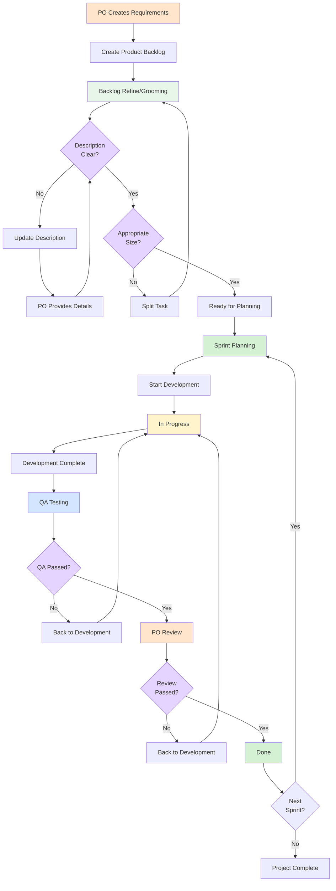

## Process Flow

## Scrum Roles

### Product Owner (PO)
- Define product vision and goals
- Manage and prioritize Product Backlog
- Ensure team understands requirements
- Accept completed work

### Developers
- Implement tasks in Sprint Backlog
- Self-organize and manage work
- Ensure code quality

### QA (Quality Assurance)
- Test features against requirements
- Ensure product quality
- Identify and report bugs

## Scrum Process Details

### 1. Product Backlog Creation

**Owner**: Product Owner

**Content**:
- Status: Backlog
- Assignee: Unassigned
- Labels: "Front-End" or "Back-End"
- Story Points: To be estimated
- Sprint: Unassigned
- Description: Requirement description
- "POs Description" field: Detailed requirement specification

### 2. Backlog Refine/Grooming

**Duration**: Weekly, 1-2 hours
**Participants**: PO, Tech Lead, Developer Representatives

**Purpose**: Ensure backlog items are ready for Sprint Planning

#### Key Activities

**Description Review**:
- Verify requirement clarity
- Confirm acceptance criteria
- Assess technical feasibility
- Identify dependencies

**If Unclear**:
- Status: Update to "Clarification needed"
- Add comments specifying needed information
- PO provides clarification
- Team reviews again

**Scope Check**:
- Story Points reasonable (recommended 1-8 points)
- Can be completed within one Sprint
- Determine if splitting is needed

**If Too Large**:
- Split into smaller subtasks
- Re-estimate Story Points
- Update Labels and Description
- Return to Refine process

**Output**: Items marked as "Ready for Planning"

**For detailed refinement process, see**: [Plan & Refine Process](2-2%20Refinement%20Process.md)

### 3. Sprint Planning

**Duration**: 2-4 hours at Sprint start
**Participants**: PO, Developers, QA

**Activities**:
1. PO explains Sprint goal
2. Select items from "Ready for Planning"
3. Confirm team capacity
4. Decide items to complete in this Sprint
5. Create Sprint Backlog

### 4. Development Phase

**Status Flow**:

1. **TO DO**
   - Status: TO DO
   - Assignee: Assigned to developer
   - Labels: "Front-End" or "Back-End"

2. **In Progress**
   - Status: In Progress
   - Assignee: Developer
   - Description: "POs Description" field, "Developer's Section" field

3. **Ready for Test**
   - Status: Ready for test
   - Assignee: Developer
   - Include: FE/BE screen captures (if applicable)
   - Description fully updated

### 5. QA Testing Phase

**Activities**:
- Execute test cases (TestRail)
- Verify features meet requirements
- Check edge cases and error handling
- Record test results

**Test Passed**:
- Status: Ready for test → Awaiting PO Review
- Assignee: Update to PO

**Test Failed**:
- Status: Return to In Progress
- Record issues in FE/BE screen captures
- Notify developer for fixes

### 6. PO Review (Product Acceptance)

**Acceptance Criteria**:
- Feature meets original requirements
- Good user experience
- Correct business logic

**Review Passed**:
- Status: Done
- Sprint: Mark as completed
- Record completion time

**Review Failed**:
- Status: Return to In Progress
- PO provides detailed feedback
- Developer adjusts based on feedback

### 7. Done

**Definition of Done (DoD)**:
- Code merged to main branch
- All tests passed
- PO acceptance completed
- Documentation updated
- Deployed to appropriate environment

## Scrum Ceremonies

### Daily Standup
- **Duration**: 15 minutes daily
- **Participants**: Developers, QA
- **Topics**:
  - What was completed yesterday
  - What is planned for today
  - Any blockers encountered

### Sprint Review
- **Duration**: End of Sprint
- **Participants**: PO, Developers, QA, Stakeholders
- **Activities**:
  - Demonstrate completed features
  - Collect feedback
  - Update Product Backlog

### Sprint Retrospective
- **Duration**: After Sprint Review
- **Participants**: Developers, QA
- **Topics**:
  - What went well
  - What needs improvement
  - Action items for next Sprint

## Story Points Estimation

### Estimation Guidelines
- **1-2 points**: Very simple, hours to complete
- **3 points**: Simple, 1-2 days to complete
- **5 points**: Medium complexity, 2-3 days to complete
- **8 points**: Complex, 3-5 days to complete
- **13+ points**: Needs to be split into smaller tasks

### Story Points vs Time
- Story Points reflect complexity and effort, not precise time
- Team Velocity stabilizes over time
- Used for Sprint capacity planning

## Labels Usage

### Technical Category
- **Front-End**: Frontend development tasks
- **Back-End**: Backend development tasks

### Priority
- **High Priority**: High priority
- **Medium Priority**: Medium priority
- **Low Priority**: Low priority

### Type
- **Bug**: Defect fix
- **Feature**: New feature
- **Enhancement**: Feature improvement
- **Refactoring**: Code refactoring
- **Documentation**: Documentation update

## Best Practices

1. **Clear Requirements**: Ensure requirements are clear during Refine phase
2. **Small Increments**: Split large tasks into smaller ones
3. **Continuous Communication**: Communicate issues promptly
4. **Fast Feedback**: Conduct Review and testing early
5. **Complete Documentation**: Keep Description and comments updated
6. **Respect Commitment**: Strive to achieve committed Sprint goals
7. **Continuous Improvement**: Review and improve in Retrospective

## Common Issues

### Requirement Changes
- PO evaluates impact if requirements change during Sprint
- Major changes should be moved to next Sprint
- Minor adjustments can be handled in current Sprint

### Cannot Complete on Time
- Raise early in Daily Standup
- Team collaborates to resolve blockers
- Adjust Sprint scope if necessary

### Bug Handling
- Urgent bugs get priority
- Non-urgent bugs added to Backlog
- Record bug root cause to prevent recurrence

---

**Related Documents**:
- [Plan & Refine Process](2-2%20Refinement%20Process.md)
- [Software Development Lifecycle](1-1%20Software%20Development%20Lifecycle.md)

**Last Updated**: 2025-10-08
**Document Owner**: Frontend Engineering Team
