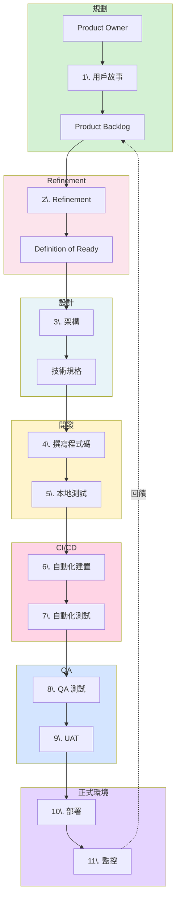

# 軟體開發生命週期

## 概覽

軟體開發生命週期（SDLC）確保產品從需求到上線的過程系統化且高品質。

## 工作流程階段

## 核心階段

### 1. 規劃
建立用戶故事、定義驗收標準、排定 backlog 優先順序。

### 2. Refinement
審查項目、評估可行性、估算工作量、確認 Definition of Ready。
*詳情請見 [Refinement Process](blog/Software%20development%20process/2-2%20Refinement%20Process.md)*

### 3. 架構設計
設計系統架構、選擇技術棧、定義需求規格。

**工具**：Figma、Excalidraw、Miro、Lucidchart、FigJam、Draw.io

### 4. 開發
撰寫程式碼、本地測試、程式碼審查、版本控制。

**工具**：Git（GitHub、GitLab、Bitbucket）、VSCode、IntelliJ、Cursor  
**AI**：Copilot、Claude Code、Cursor AI  
**API Mocking**：MSW、JSON Placeholder、JSON Server

### 5. 持續整合
自動化建置、測試套件、程式碼覆蓋率、靜態分析。

**CI**：Jenkins、CircleCI、GitLab CI、Travis CI、Buildkite  
**品質**：SonarQube、CodeClimate

### 6. 測試環境

**QA**：執行測試、驗證需求、回歸測試  
**UAT**：關係人驗收、類正式環境測試

**工具**：Playwright、Cypress、Selenium、Percy、Chromatic、Lighthouse  
**跨瀏覽器**：BrowserStack、LambdaTest

### 7. 部署
漸進式發布、功能開關、藍綠/金絲雀部署、煙霧測試。

**策略**：
- Feature Toggles：控制功能可見性
- Canary：漸進式發布（5% → 100%）
- Blue-Green：零停機部署

**平台**：Vercel、Netlify、Railway、Render、DigitalOcean

### 8. 監控
錯誤追蹤、效能指標、用戶分析、告警通知。

| 類別 | 工具 |
|------|------|
| 錯誤 | Sentry、Rollbar、Bugsnag |
| 效能 | Datadog、New Relic、Grafana |
| 日誌 | ELK Stack、Splunk、Loki |
| 用戶分析 | PostHog、Google Analytics |

## 應避免的反模式

- 手動部署、長生命週期功能分支
- 跳過程式碼審查、沒有自動化測試
- 忽略監控告警
