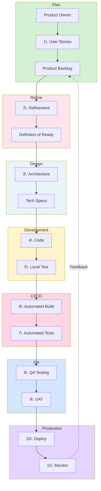

# Software Development Lifecycle

## Overview

The Software Development Lifecycle (SDLC) ensures systematic, high-quality product delivery from requirements to production.

## Workflow Stages

## Core Stages

### 1. Planning
Create user stories, define acceptance criteria, prioritize backlog.

### 2. Refinement
Review items, assess feasibility, estimate effort, verify Definition of Ready.
*See [Refinement Process](blog/Software%20development%20process/2-2%20Refinement%20Process.md) for details*

### 3. Architecture Design
Design system architecture, select tech stack, define requirements.

**Tools**: Figma, Excalidraw, Miro, Lucidchart

### 4. Development
Write code, local testing, code review, version control.

**Tools**: Git (GitHub, GitLab, Bitbucket), VSCode, IntelliJ, Cursor
**AI**: Copilot, Claude Code, Cursor AI

### 5. Continuous Integration
Automated build, test suites, code coverage, static analysis.

**CI**: Jenkins, CircleCI, GitLab CI, Travis CI, Buildkite
**Quality**: SonarQube, CodeClimate

### 6. Testing Environments

**QA**: Execute tests, verify requirements, regression testing
**UAT**: Stakeholder validation, production-like environment

**Tools**: Playwright, Cypress, Selenium, Percy, Chromatic, Lighthouse

### 7. Deployment
Gradual rollout, feature toggles, blue-green/canary deployment, smoke tests.

**Strategies**:
- Feature Toggles: Control visibility
- Canary: Gradual rollout (5% → 100%)
- Blue-Green: Zero-downtime

**Platforms**: Vercel, Netlify, Railway, Render, DigitalOcean

### 8. Monitoring
Error tracking, performance metrics, user analytics, alerting.

**Tools**:
- Errors: Sentry, Rollbar, Bugsnag
- Performance: Datadog, New Relic, Grafana
- Logs: ELK Stack, Splunk, Loki

## Key Principles

**Automation First**: Automate builds, tests, deployments
**Quality Gates**: Multiple checks before production
**Environment Progression**: Dev → QA → UAT → Production
**Continuous Feedback**: Monitor and iterate

## Best Practices

- **Shift Left Testing**: Test early, catch issues in development
- **Trunk-Based Development**: Short-lived branches, frequent integration
- **Infrastructure as Code**: Docker, Kubernetes, Terraform
- **Observability**: Logging, tracing, alerting
- **AI-Powered Workflows**: MCP integration for intelligent assistance

## Anti-Patterns to Avoid

- Manual deployments
- Long-lived feature branches
- Skipping code reviews
- No automated testing
- Ignoring monitoring alerts
