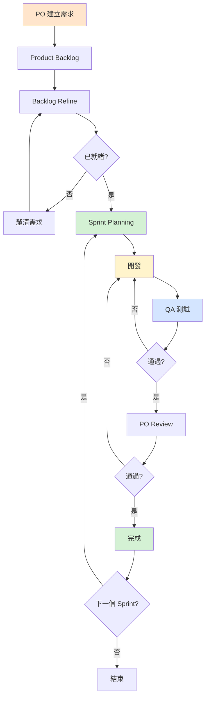

# Scrum 流程

## 流程圖

## Scrum 角色

**Product Owner**：定義願景、管理 backlog、驗收成果  
**開發人員**：實作功能、自我組織、確保品質  
**QA**：測試功能、識別缺陷、確認需求達成

## Scrum 流程

### 1. Product Backlog
Product Owner 建立用戶故事，包含：
- 描述與驗收標準
- 優先順序與標籤
- 估算 Story Points  
*估算細節請見 [Refinement Process](blog/Software%20development%20process/2-2%20Refinement%20Process.md)*

### 2. Sprint Planning
**時長**：2–4 小時  
**參與者**：PO、開發人員、QA

**活動**：
1. PO 說明 Sprint 目標
2. 從「已就緒」的 backlog 中選取項目
3. 確認團隊產能
4. 建立 Sprint Backlog

### 3. 開發
**狀態流**：待辦 → 進行中 → 待測試

**重點行動**：
- 依標準撰寫程式碼
- 更新描述與截圖
- 定期提交並附上清楚的 commit 訊息

### 4. QA 測試
**活動**：執行測試、驗證需求、檢查邊界情況

測試工具詳見 [[3-3 Testing and Reviewing]]。

**通過**：移至 PO Review  
**未通過**：附回饋退回開發

### 5. PO Review
**標準**：符合需求、良好使用者體驗、業務邏輯正確

**通過**：標記為完成  
**未通過**：退回開發

### 6. 完成
**Definition of Done**：
- 程式碼已合併至主線
- 所有測試通過
- PO 已驗收
- 文件已更新
- 已部署

## Scrum 儀式

### 每日站會（15 分鐘）
- 昨天完成了什麼
- 今天計劃做什麼
- 有無阻礙事項

### Sprint Review
展示功能、收集回饋、更新 backlog

### Sprint 回顧
哪些做得好、哪些需要改進、行動項目

## 常見問題

**需求變更**：PO 評估影響，重大變更 → 移至下一個 Sprint  
**無法如期完成**：在站會中儘早提出，必要時調整範圍  
**緊急缺陷**：立即優先處理，非緊急 → 加入 backlog
