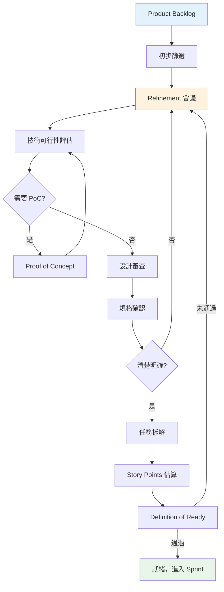

# Refinement 流程

## 概覽

Refinement 流程確保用戶故事在進入 Sprint Planning 之前經過充分審查與準備。

## 流程圖



## Refinement 會議

**時長**：每個 Sprint 4–6 小時  
**參與者**：PO、Tech Lead、開發人員

**議程**：
1. 需求說明
2. 技術可行性評估
3. 設計資產審查
4. 規格釐清
5. 任務拆解
6. Story Points 估算

## 技術可行性

**評估面向**：
- 團隊技術能力
- 技術風險
- 效能影響
- 相依性
- 瀏覽器相容性

**Proof of Concept（PoC）**：  
適用情境：
- 新技術或不熟悉的技術
- 技術不確定性高
- 需要效能驗證
- 複雜的第三方整合

**PoC 流程**：定義問題 → 時間框 1–3 天 → 建立原型 → 評估 → 決策

## 設計資產審查

**檢查清單**：
- 設計稿已完成
- 已參照設計系統元件
- 互動原型（如需要）
- 規格已記錄（間距、顏色、字型）
- 邊界情況與響應式設計已涵蓋

## 規格完整性

**檢查項目**：
- 功能規格（輸入、輸出、邏輯）
- 介面規格（API 端點、格式）
- 設計規格（視覺、互動、狀態）
- 效能規格（回應時間、載入速度）
- 安全規格（驗證、加密）

**警示訊號**：
- 模糊描述（「優化」、「改善」）
- 無具體指標
- 缺少成功標準

## 任務描述

### 用戶故事格式
```
身為 [角色]
我希望 [功能]
以便 [價值]

驗收標準：
- [ ] 標準 1
- [ ] 標準 2
```

### BDD 格式
適用於複雜邏輯：
- **Given**：初始狀態
- **When**：用戶操作
- **Then**：預期結果

## 任務拆解

**垂直切片**（建議做法）：  
完整功能切片（UI → 邏輯 → 測試）

**優點**：
- 可獨立完成
- 減少相依性
- 提早整合
- 持續交付價值

**原則**：
- 每個任務 < 7 Story Points（理想 3–5）
- 每個任務 < 3 天
- 可獨立驗證
- 具備邏輯順序

## Story Points 估算

### Story Points 反映什麼
- **複雜度**：技術難度
- **工作量**：所需時間與精力
- **不確定性**：技術風險

**不代表精確時間**——用於相對比較

### 點數規模

| 點數 | 複雜度 | 範例 |
|------|--------|------|
| 1 | 極簡單 | 文字修改、樣式調整 |
| 3 | 簡單 | 單一元件、基本表單 |
| 5 | 中等 | 多步驟流程 |
| 7 | 複雜 | 複雜邏輯、多項整合 |
| 9 | 非常複雜 | 建議拆分 |

### 估算流程
1. PO 說明需求
2. 團隊討論實作方式
3. 各自獨立評估
4. 同時揭露點數
5. 討論差異
6. 達成共識

### 團隊速度（Velocity）
**定義**：每個 Sprint 完成的 Story Points 總計

**用途**：
- 規劃下個 Sprint 的產能
- 追蹤交付能力
- 識別瓶頸

**注意**：新團隊需要 2–3 個 Sprint 才能穩定

## Definition of Ready

任務必須符合：
- [ ] 具備明確的商業價值
- [ ] 驗收標準已定義
- [ ] 技術可行性已確認
- [ ] 相依性已識別
- [ ] Story Points 已估算
- [ ] 設計稿已備妥（如需要）
- [ ] API 規格已備妥（如需要）
- [ ] 團隊理解需求

## 非功能性需求

在 Refinement 階段需確認（測試細節見 [[3-3 Testing and Reviewing]]）：
- 效能：頁面載入 < 3 秒，互動回應 < 100ms
- 安全：輸入驗證、XSS/CSRF 防護
- 無障礙：符合 WCAG 2.1 AA
- i18n：多語系支援（如需要）
