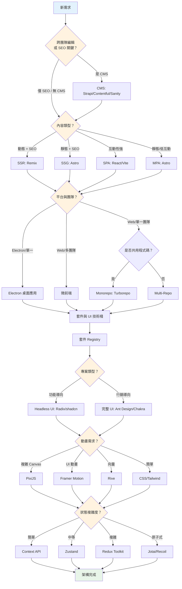
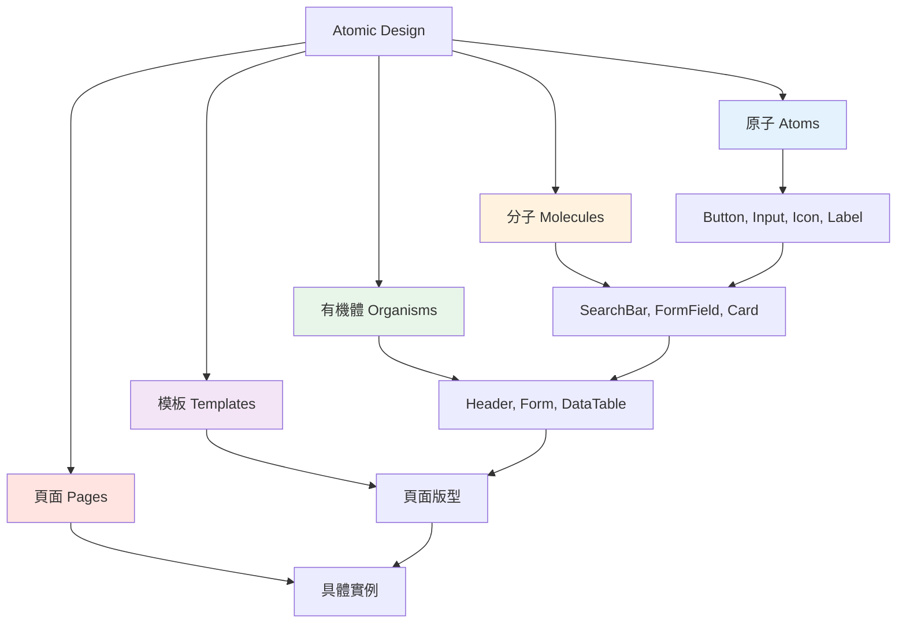

## 概述

以下是選擇前端架構的流程——從渲染策略到狀態管理與元件系統。

## 前端專案決策流程

## 架構決策

### 內容管理系統（CMS）

**何時使用 CMS**：
- **跨團隊編輯需求**：行銷、內容團隊需要直接存取
- **SEO 關鍵內容**：部落格、登陸頁、產品頁
- 非技術人員需頻繁更新內容
- 多語言內容管理

**CMS 選項**：
- **Strapi**：開源、自架、高度客製化
- **Contentful**：雲端、強大 API、企業級
- **Sanity**：即時協作、彈性的內容建模

### Repository 策略：Monorepo vs Multi-Repo

| 考量點 | Monorepo | Multi-Repo |
|--------|----------|------------|
| **使用情境** | 多專案共用元件、統一 CI/CD | 獨立專案、不同技術棧 |
| **優點** | 程式碼共用、原子性變更、統一工具鏈 | 權限隔離、獨立部署、學習曲線低 |
| **缺點** | 建置時間長、權限管理複雜 | 依賴重複、版本不一致 |
| **工具** | Turborepo、pnpm workspace | Git Submodules、獨立 repo |

**何時使用 Monorepo**：
- 跨專案共用元件庫
- 統一設計系統
- 一致的工具鏈與規範
- 跨專案的原子性變更

**何時使用 Multi-Repo**：
- 完全獨立的專案
- 不同技術棧
- 不同部署排程
- 嚴格的權限邊界

### 渲染策略

| 模式 | 適用情境 | 工具 |
|------|---------|------|
| SPA | 豐富互動、客戶端路由 | React + Vite |
| MPA | 傳統導覽、SEO 友善 | Astro |
| SSG | 靜態內容、CDN 優化 | Astro、Docusaurus |
| SSR | 動態內容、即時資料 | Remix |

### 平台選項

**Electron**：需要硬體控制（USB、藍牙）、檔案系統存取、或離線優先的桌面應用。跨平台部署（Windows、macOS、Linux）。

### 套件管理

**私有 Registry**：
- npm private packages、GitHub Packages、GitLab Package Registry
- JFrog Artifactory、Verdaccio
- 版本控制與原始碼並行管理

**公開 Registry**：
- npm、yarn、pnpm
- 語意化版本
- 開源發布

### 微前端

**何時使用**：
- 多團隊協作的大型應用
- 獨立部署週期
- 各團隊技術彈性

**實作方式**：
- Single-SPA 框架
- Web Components
- Iframe 整合

## 技術選型

### 元件策略

**專案類型決定 UI 方向**：

**功能導向專案**（內部工具、儀表板、SaaS）：
- **Headless UI 函式庫**：Radix UI、shadcn/ui
- 最大化彈性與客製化
- 從基礎元件建立設計系統
- 更好的效能控制

**行銷導向專案**（登陸頁、企業網站）：
- **完整 UI 函式庫**：Ant Design、Chakra UI
- 快速原型與部署
- 開箱即用的一致設計
- 豐富元件生態

動畫工具比較見 [[Web Animation Tools Comparison]]。

### 狀態管理

| 方案 | 適用情境 |
|------|---------|
| Context API | 主題、認證、語系等簡單全域狀態 |
| Zustand | 中等複雜度、最少樣板 |
| Redux Toolkit | 複雜業務邏輯、需時間旅行除錯 |
| Jotai / Recoil | 原子式狀態、細粒度元件更新 |

### 資料層

| 類型 | 工具 | 用途 |
|------|------|------|
| Server State | React Query、SWR | 快取、重新驗證、樂觀更新 |
| Form State | React Hook Form、Formik | 驗證、效能優化 |
| Router State | React Router、Next.js Router | URL 狀態管理 |
| Local/UI State | useState、useReducer | 元件層級暫態狀態 |

程式設計典範的選擇（FP vs OOP）見 [[What is Elegant Code]]。

常用設計模式見 [[Overview of 14 Design Patterns]]。

## 元件架構

### Atomic Design 方法論

測試策略詳見 [[3-3 Testing and Reviewing]]。MCP 整合設定見 [[Claude Code integrate MCP servers]]。

## 鎖定前的確認清單

- 從簡單開始——只有在有具體理由時才增加複雜度
- 記錄重大決策（ADR - 架構決策記錄），讓未來的隊友了解背後的原因
- 在開始建置前讓團隊對技術選型達成共識；中途更換架構代價高昂
- 從第一天起就實施視覺回歸測試
- 為關鍵使用者流程設置 E2E 測試
- 善用 MCP 進行 AI 輔助開發工作流程
- 根據回饋持續迭代改進
