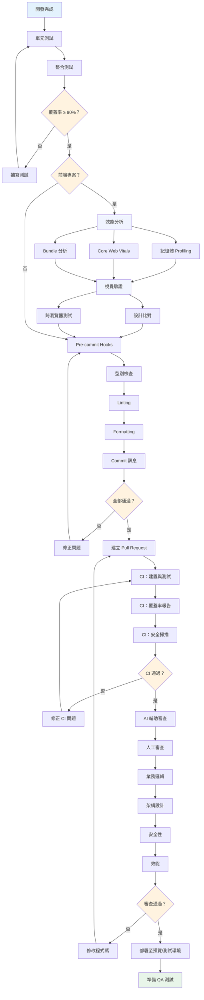

## 概述

測試發生在每個層級：本地提交前、CI 中，以及審查時的手動測試。涵蓋從單元測試到 E2E、程式碼審查，到正式環境監控的完整流程。

## 測試與 QA 流程



## 本地測試

### 單元測試

**前端框架**：Vitest、Jest、Testing Library、React Testing Library

**後端框架**：pytest（Python）、Jest（Node.js）、JUnit（Java）

**覆蓋率目標**：≥ 90%，聚焦關鍵業務邏輯與邊界案例。

### 整合測試

**目的**：測試元件/模組之間的互動

**前端**：元件整合測試、API 整合測試（MSW、Nock）、E2E 測試（Playwright、Cypress）

**後端**：API 端點測試、資料庫整合測試、服務間通訊

### 效能分析

**前端效能**：
- 記憶體 Profiling（Chrome DevTools、React DevTools）
- Core Web Vitals（LCP < 2.5s、FID < 100ms、CLS < 0.1）
- Bundle 分析（Rollup Visualizer、webpack-bundle-analyzer）
- Lighthouse CI 自動化效能測試

**後端效能**：
- 回應時間量測、資料庫查詢優化
- 壓力測試（Locust、k6、Artillery）

### E2E 測試

**Playwright**（推薦）：跨瀏覽器測試（Chromium、Firefox、WebKit）、內建視覺比對、並行執行、追蹤除錯工具。

**Cypress**：開發者友善的 API、即時重載、時間旅行除錯、元件測試。

**最佳實踐**：測試關鍵使用者旅程、使用 data-testid 屬性、避免不穩定的選擇器、在 CI/CD 流水線中執行、並行化測試以加速。

### 視覺測試

**Percy**：自動視覺審查、Storybook 整合、跨視口響應式測試、審查工作流程。

**Chromatic**：Storybook 元件的視覺測試、抓出非預期的 UI 變更、協作審查工具。

**Playwright 視覺比對**：內建截圖測試、像素級比對、跨瀏覽器視覺測試。

## Pre-commit 檢查

**Husky**：在提交前執行 Git hooks 檢查。

**lint-staged**：只檢查修改過的檔案，加速執行。

| 檢查項 | 前端 | 後端 |
|--------|------|------|
| 型別檢查 | TypeScript strict mode | mypy |
| Linting | ESLint | Ruff（Python）、ESLint（Node.js）|
| Formatting | Prettier | Black（Python）、Prettier（Node.js）|
| Commit 訊息 | commitlint：`type(scope): description` | 同左 |

## CI 流水線

### 推送後自動執行

**建置與測試**：運行單元測試、生成覆蓋率報告、驗證建置。

**安全掃描**：
- 依賴審計（npm audit、pnpm audit）
- 安全平台（Snyk、Dependabot）
- SAST 靜態分析（SonarQube、CodeQL）

**視覺與 E2E 測試**：E2E 框架（Playwright、Cypress）、視覺回歸（Percy、Chromatic）、跨瀏覽器測試矩陣。

## 人工審查

### 程式碼審查員

**業務邏輯**：符合使用者故事需求、邊界案例處理（null、錯誤、載入狀態）、資料驗證與錯誤處理。

**安全需求**：
- 前端：XSS/CSRF 防護、安全資料儲存
- 後端：認證/授權、輸入驗證、SQL injection 防護
- 敏感資料處理（加密、安全傳輸）

**架構設計**：單一職責、清晰的關注點分離、可維護且可擴展的程式碼結構。

**效能考量**：
- 前端：避免不必要的重新渲染、優化 Bundle 大小
- 後端：查詢優化、快取策略、資源管理

### AI 輔助審查

AI 審查工具比較見 [[AI Code Reviewer Comparison]]。

## 部署

| 環境 | 觸發 | 說明 |
|------|------|------|
| 預覽 | PR 建立 | 自動部署，供團隊審查實際實作 |
| 測試 | 合併至 develop | 正式環境前的最終測試 |
| 正式 | 合併至 main（手動觸發）| 冒煙測試，備有回滾計畫 |

監控工具見 [[1-1 Development Lifecycle]]。

## 真正有效的關鍵習慣

在實踐中，影響最大的習慣是：**並行化 E2E 測試**（回饋速度快 10 倍）、**從第一天起加入視覺回歸**（在使用者發現前抓到細微的 UI 破壞），以及**在審查時使用 MCP** 發現人工審查容易遺漏的問題。其他的都是基本配備。

## 測試金字塔

```
       /\
      /  \     E2E 測試（少量）
     /____\    - 關鍵使用者流程
    /      \   - 跨瀏覽器
   /________\  整合測試（適量）
  /          \ - API 整合
 /____________\- 元件整合
/              \ 單元測試（大量）
                 - 純函數
                 - 業務邏輯
```

**視覺測試層**：跨所有層級執行
**MCP 整合**：透過 AI 洞察強化所有測試階段
